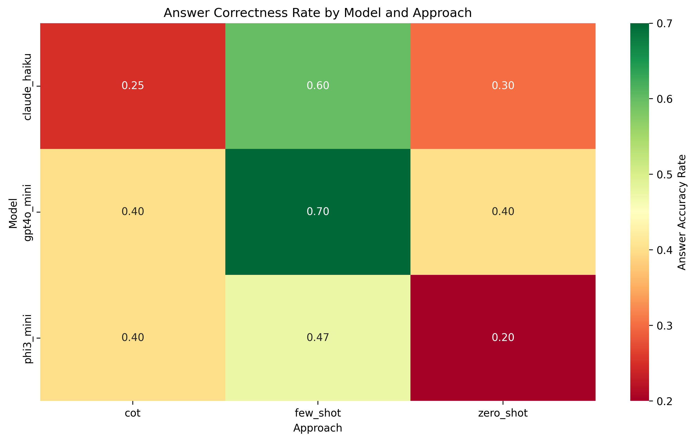
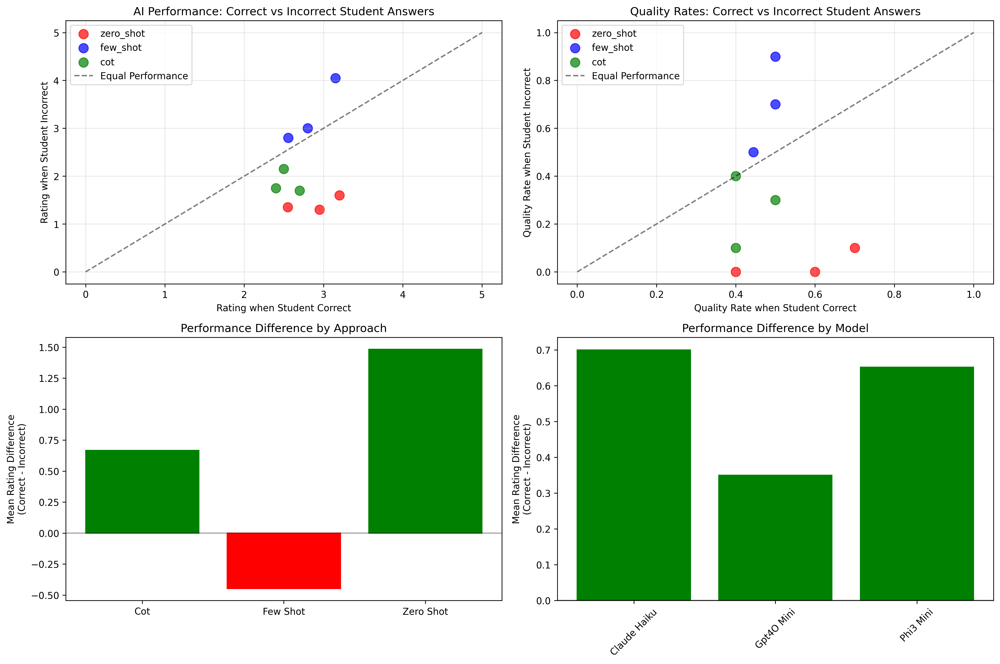
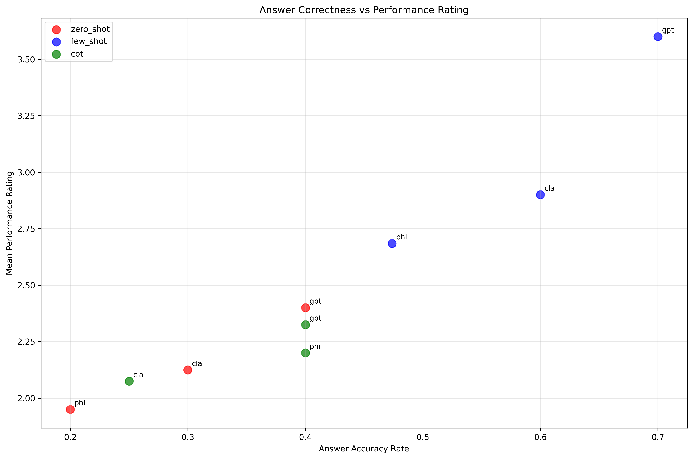

# Toy AI Tutoring Evaluation

**A comprehensive evaluation of AI language models for mathematics tutoring applications**

## 🎯 Key Findings

### **Few-shot GPT-4o Mini emerges as the superior AI tutor**, especially for the most critical tutoring scenario: helping students with incorrect answers.

| Model + Approach | Overall Rating | Quality Rate | Performance with Incorrect Answers |
|------------------|----------------|--------------|-----------------------------------|
| **Few-shot GPT-4o Mini** | **3.60/5.0** | **70%** | **90% quality rate** |
| Few-shot Claude Haiku | 2.90/5.0 | 60% | 70% quality rate |
| Zero-shot GPT-4o Mini | 2.40/5.0 | 40% | 10% quality rate |

### 🚀 Critical Discovery
**Few-shot GPT-4o Mini performs BETTER when students give wrong answers** - achieving 90% high-quality responses with incorrect student answers vs only 50% with correct answers. This makes it uniquely valuable for real tutoring scenarios where guidance and correction are needed most.

## 📊 Methodology

- **Models Evaluated**: Claude Haiku, GPT-4o Mini, Phi-3 Mini
- **Approaches Tested**: Zero-shot, Few-shot, Chain-of-Thought (CoT)
- **Dataset**: 20 mathematics tutoring scenarios across 5 subjects
- **Quality Metric**: Rating ≥ 3.0 out of 5.0 (pedagogically sound tutoring)
- **Student Baseline**: 50% gave correct answers initially

## 📈 Key Visualizations

### Answer Correctness Performance Heatmap


Shows few-shot approaches (especially GPT-4o Mini) achieving the highest quality rates across all model combinations.

### Student Correctness Impact Analysis


Four-panel analysis revealing that few-shot GPT-4o Mini uniquely excels when students provide incorrect answers - the most important tutoring scenario.

### Performance vs Rating Correlation


Demonstrates the relationship between different approaches and their tutoring effectiveness.

## 📂 Repository Structure

```
toy-ai-tutoring-evaluation/
├── README.md                                    # This overview
├── EXECUTIVE_SUMMARY_REPORT.md                  # Academic summary report
├── data/                                        # All evaluation datasets
│   ├── TutoringExperiment_evaluation_20250719.csv
│   ├── enhanced_correctness_analysis.csv
│   ├── student_correctness_impact_results.csv
│   ├── performance_summary.csv
│   └── tutoring_results_20250719_140215.csv
├── visualizations/                              # All analysis charts
│   ├── answer_correctness_heatmap.png
│   ├── student_correctness_impact_analysis.png
│   ├── accuracy_vs_rating.png
│   ├── tutoring_analysis_plots.png
│   └── subject_model_analysis.png
├── analysis/                                    # Python analysis scripts
│   ├── enhanced_analysis.py                    # Main enhanced analysis
│   ├── student_correctness_impact_analysis.py  # Student correctness study
│   ├── accuracy_methodology_explanation.py     # Methodology validation
│   ├── actual_correctness_analysis.py          # Ground truth analysis
│   └── run_experiment.py                       # Original experiment runner
└── docs/                                        # Additional documentation
    └── EVALUATION_REPORT.md                     # Detailed technical report
```

## 🔍 Research Findings

### 1. **Few-shot Prompting Superiority**
- **Average Quality Rate**: 59.1% (vs 35% for CoT, 30% for zero-shot)
- **Best Performer**: GPT-4o Mini with 70% overall quality rate
- **Consistent Performance**: Works well across all mathematical subjects

### 2. **Student Answer Correctness Impact**
- **Critical Pattern**: Most approaches perform worse with incorrect student answers
- **Few-shot Exception**: GPT-4o Mini performs 40% BETTER with incorrect answers
- **Zero-shot Failure**: 0-10% quality rate when students need help most

### 3. **Subject Distribution**
- **Geometry**: 60% student success rate (easiest)
- **Algebra, Elementary, Trigonometry**: 50% student success rate
- **Calculus**: 0% student success rate (most challenging, 1 case)

### 4. **Qualitative Insights**
- **CoT Limitation**: Tends to solve problems FOR students rather than guiding them
- **Zero-shot Issues**: Occasional hallucination of non-existent conversation elements
- **Few-shot Strengths**: Optimal balance of brevity, empathy, and pedagogical appropriateness

## 🚀 Getting Started

### Prerequisites
```bash
pip install pandas numpy matplotlib seaborn scipy
```

### Running the Analysis
```bash
# Main enhanced analysis with correctness evaluation
python analysis/enhanced_analysis.py

# Student correctness impact study
python analysis/student_correctness_impact_analysis.py

# Methodology validation
python analysis/accuracy_methodology_explanation.py
```

### Reproducing Results
1. Clone this repository
2. Install dependencies
3. Run the analysis scripts in the `analysis/` directory
4. Generated visualizations will match those in `visualizations/`

## 📋 Key Metrics Explained

### High-Quality Response Definition
**Rating ≥ 3.0 out of 5.0**
- Indicates pedagogically sound tutoring guidance
- Measures effective teaching approach and empathy
- Independent of whether student's original answer was correct
- Focuses on AI tutoring effectiveness, not student performance

### Student Answer Baseline
- **50% of students** gave correct answers initially (10/20 cases)
- Provides context for the difficulty of tutoring scenarios
- Demonstrates importance of handling incorrect responses effectively

## 🎓 Academic Impact

This research reveals that **few-shot prompting with GPT-4o Mini represents a significant advancement in AI tutoring systems**, particularly because it excels in corrective tutoring scenarios where students need the most help.

## 🤝 Contributing

For questions or collaboration opportunities, please open an issue or contact the research team.

## 📝 License

This research is shared for educational and academic purposes. All data and analysis scripts are included for reproducibility.

---
